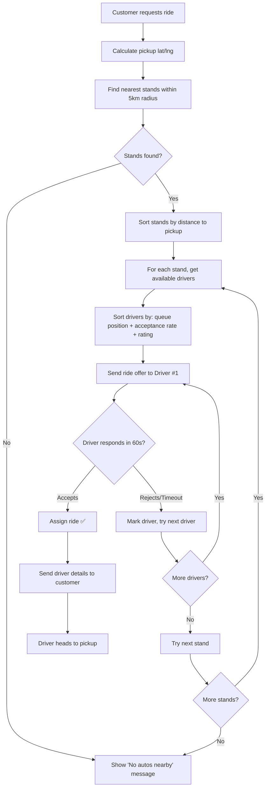

# 🛺 AP — Auto Rickshaw Platform for Coastal Cities

## Complete Startup Blueprint & Implementation Plan

> **Founder:** Adish  
> **Target Cities:** Udupi, Mangalore, and Coastal Karnataka  
> **Timeline:** 12 months to production  
> **Date:** April 5, 2026

---

## Part 1: The Problem & Market Analysis

### 1.1 The Problems You Identified

| # | Problem | Who Faces It | Severity |
|---|---------|-------------|----------|
| 1 | Drivers get only 4–5 trips/day | Auto Drivers | 🔴 Critical — affects their livelihood |
| 2 | Tourists can't find auto numbers | Customers (tourists) | 🔴 Critical — no discovery mechanism |
| 3 | Drivers don't answer calls | Customers | 🟠 High — unreliable experience |
| 4 | Inconsistent pricing | Both | 🟠 High — trust issue |
| 5 | Auto stands far from customers | Customers | 🟡 Medium — convenience gap |
| 6 | Drivers earn nothing for return trip | Drivers | 🔴 Critical — hidden cost eats their income |

### 1.2 Why Uber/Ola Don't Work in These Cities

| Factor | Metro (Bangalore) | Coastal (Udupi/Mangalore) |
|--------|-------------------|--------------------------|
| **Demand density** | Very high — constant rides | Low — sporadic bursts (tourist seasons, mornings, evenings) |
| **Driver pool** | Thousands available | 50–200 autos per area |
| **Trip distance** | Short (3–8 km) | Mixed (2–30 km, temple visits, beach routes) |
| **Stand culture** | No stands — drivers roam | Strong stand culture — drivers sit at defined spots |
| **Return trips** | Driver gets next ride quickly | Driver returns EMPTY to stand — huge dead mileage |
| **Tourist pattern** | None (commuters only) | Heavy — temples, beaches, heritage sites |
| **Pricing expectation** | Metered / app-based | Negotiated — "how much to Manipal?" |

### 1.3 Your Unique Advantage: The Stand-Based Model

```
┌─────────────────────────────────────────────────────────┐
│                  UBER MODEL                              │
│  Driver roams → Gets ride → Drops → Roams for next      │
│  Works in: Dense cities with continuous demand           │
└─────────────────────────────────────────────────────────┘

┌─────────────────────────────────────────────────────────┐
│                  AP MODEL (Your Innovation)               │
│  Driver at Stand → Gets ride → Drops → Returns to Stand  │
│  Platform pays for: Pickup trip + Active trip + Return   │
│  Works in: Smaller cities with stand-based culture       │
└─────────────────────────────────────────────────────────┘
```

> [!IMPORTANT]
> **The key innovation:** Compensating drivers for the return-to-stand dead mileage. This makes AP fundamentally different from Uber/Ola and specifically designed for markets they can't serve profitably.

### 1.4 Target Market Sizing (Estimated)

| City | Est. Autos | Est. Daily Rides | Your Target (Year 1) |
|------|-----------|-----------------|---------------------|
| Udupi city + Manipal | ~500 | ~2,000 | 200 rides/day |
| Mangalore | ~2,000 | ~8,000 | 500 rides/day |
| Kundapura | ~200 | ~500 | 50 rides/day |
| Karwar | ~150 | ~400 | 50 rides/day |
| **Total Year 1** | **~2,850** | **~10,900** | **~800 rides/day** |

---

## Part 2: Features Reused from Logistics Platform

### 2.1 What to REUSE (Directly Applicable)

| Feature | From Logistics | Adapted For AP |
|---------|---------------|---------------|
| **WhatsApp onboarding** | 15-step driver verification | Simplified 5-step auto driver onboarding |
| **H3 Geospatial** | Serviceability checking | Stand area definition + nearest stand finding |
| **Trip state machine** | 6-step goods delivery | 4-step passenger ride (Accept → Pickup → Ride → Drop) |
| **Dead KM tracking** | Base→Pickup + Drop→Base | Stand→Pickup + Drop→Stand |
| **Dynamic pricing** | DB-driven, per-class | DB-driven, per-zone (urban/semi-urban/rural) |
| **Driver rating system** | Trips completed, on-time % | Acceptance rate, customer rating, on-time % |
| **Operations dashboard** | React admin panel | Same architecture, auto-specific views |
| **Payment integration** | Cashfree payment links | In-app payments + cash option |
| **GPS tracking** | Real-time location sharing | Live tracking for customer + ops |
| **Assignment algorithm** | Heuristic nearest vehicle | Nearest available driver at nearest stand |
| **Photo verification** | Loading/unloading photos | Driver selfie for verification (optional) |
| **Escalation system** | Trip issues & resolution | Customer complaints & driver issues |
| **Invoice generation** | HTML→PDF invoices | Digital ride receipts |

### 2.2 What to BUILD NEW

| Feature | Why It's New | Priority |
|---------|-------------|----------|
| **Customer mobile app** | Logistics used WhatsApp only | 🔴 Must Have |
| **Driver mobile app** | Logistics had basic app | 🔴 Must Have |
| **Stand management** | New concept — auto stands as hubs | 🔴 Must Have |
| **Return-trip compensation model** | Your unique innovation | 🔴 Must Have |
| **Fare estimator** | Real-time fare before booking | 🔴 Must Have |
| **Live ride tracking map** | Like Uber's map view | 🔴 Must Have |
| **OTP-based ride start** | Security for customer/driver | 🟠 Should Have |
| **Scheduled rides** | "Book for tomorrow 6 AM" | 🟡 Nice to Have |
| **Multi-stop rides** | Temple circuit: A→B→C→D | 🟡 Nice to Have |
| **Tourist packages** | "Full day auto ₹1,500" | 🟡 Nice to Have |
| **Surge pricing** | Festival season, rainy days | 🟡 Nice to Have (Phase 2) |
| **Driver earnings dashboard** | Daily/weekly earning reports | 🟠 Should Have |
| **SOS emergency button** | Safety for passengers | 🟠 Should Have |
| **Referral system** | Both driver & customer | 🟡 Nice to Have |

### 2.3 What to NOT Reuse (Not Applicable)

| Logistics Feature | Why NOT for AP |
|-------------------|---------------|
| Vehicle classification (9 classes) | Only 1 class: auto rickshaw |
| Loading/unloading photos | No goods — it's people transport |
| LangGraph conversation AI | Over-engineered for simple bookings |
| gRPC vehicle selector | Simpler matching needed |
| Booking modification | Rides are instant, not scheduled |
| Hourly booking model | Not needed initially |

---

## Part 3: The Pricing Model (Your Innovation)

### 3.1 The Problem with Current Auto Pricing

```
Current Reality (Driver's Perspective):
━━━━━━━━━━━━━━━━━━━━━━━━━━━━━━━━━━━━
Stand ──(3km, earns ₹0)──→ Pickup ──(15km, earns ₹210)──→ Drop ──(10km, earns ₹0)──→ Stand
                                      ↑                            ↑
                               Only THIS is paid           Return trip = total loss!
                               
Driver's actual cost:  Fuel for 3+15+10 = 28 km
Driver's earning:      Only for 15 km = ₹210
Driver's fuel cost:    28 km × ₹3/km = ₹84
Net earning:           ₹210 - ₹84 = ₹126 (for ~1.5 hours of work)
```

### 3.2 AP's Pricing Model — The Complete Solution

#### The Three-Part Fare Structure

```
┌────────────────────────────────────────────────────────────┐
│               AP FARE BREAKDOWN                             │
│                                                             │
│  Part A: Initial Dead KM (Stand → Pickup)                  │
│  ├─ Fixed charge: ₹25 (up to 2 km)                        │
│  └─ Beyond 2 km: ₹8/km                                    │
│                                                             │
│  Part B: Active Ride (Pickup → Drop)                       │
│  ├─ Base fare: ₹30                                         │
│  ├─ Per km: ₹15/km                                         │
│  └─ Per minute (waiting): ₹2/min                           │
│                                                             │
│  Part C: Return Dead KM (Drop → Stand) — YOUR INNOVATION  │
│  ├─ Per km: ₹5/km (subsidized rate)                        │
│  └─ Cap: Maximum ₹50 (10 km equivalent)                   │
│                                                             │
│  Customer pays: Part A + Part B + Return Surcharge (₹10–30)│
│  Driver gets:   Part A + Part B + Part C                   │
│  AP earns:      Commission from Part B + Return Surcharge  │
└────────────────────────────────────────────────────────────┘
```

#### Detailed Pricing Formula

```python
# CUSTOMER PAYS:
customer_fare = base_fare + (active_km × per_km_rate) + (waiting_min × per_min_rate) 
                + initial_dead_charge + return_surcharge

# DRIVER RECEIVES:
driver_earning = initial_dead_charge + (active_km × per_km_rate × driver_share%)
                + (waiting_min × per_min_rate) + return_dead_compensation

# AP COMMISSION:
ap_revenue = (active_km × per_km_rate × commission%) + return_surcharge - return_dead_compensation
```

#### Example Scenario

```
Trip: Tourist at Hotel → Udupi Sri Krishna Temple (8 km)
Stand: Manipal Auto Stand (3 km from hotel)
Return: Temple → Stand (6 km)

CUSTOMER PAYS:
├─ Base fare:              ₹30
├─ Active ride (8 km):     8 × ₹15 = ₹120
├─ Initial dead (3 km):    ₹25 + (1 × ₹8) = ₹33
├─ Return surcharge:       ₹20
├─ Waiting (0 min):        ₹0
└─ TOTAL:                  ₹203

DRIVER RECEIVES:
├─ Initial dead:           ₹33
├─ Active ride (80%):      ₹120 × 0.80 = ₹96
├─ Waiting:                ₹0
├─ Return dead (6 km):     6 × ₹5 = ₹30
└─ TOTAL:                  ₹159

AP REVENUE:
├─ Commission (20%):       ₹120 × 0.20 = ₹24
├─ Return surcharge:       ₹20
├─ Return compensation:    -₹30
└─ NET:                    ₹14 per trip
```

### 3.3 Revenue Projections

| Phase | Rides/Day | Avg Fare | AP Revenue/Trip | Daily Revenue | Monthly Revenue |
|-------|----------|----------|----------------|--------------|----------------|
| **Month 1–3** | 50 | ₹180 | ₹12 | ₹600 | ₹18,000 |
| **Month 4–6** | 200 | ₹200 | ₹14 | ₹2,800 | ₹84,000 |
| **Month 7–9** | 500 | ₹200 | ₹15 | ₹7,500 | ₹2,25,000 |
| **Month 10–12** | 800 | ₹220 | ₹16 | ₹12,800 | ₹3,84,000 |

> [!WARNING]
> **Break-even target:** ~500 rides/day with ₹15 margin = ₹7,500/day = ₹2.25L/month. Server costs + team salary should be below this. Keep infrastructure costs LOW in early phases (no AWS, use cheap VPS).

### 3.4 Zone-Based Pricing

Instead of 9 vehicle classes, AP uses **3 pricing zones:**

| Zone | Area | Per KM Rate | Examples |
|------|------|------------|---------|
| **Urban** | City center, dense areas | ₹15/km | Udupi town, Mangalore city |
| **Semi-Urban** | Outskirts, connecting roads | ₹18/km | Manipal, Surathkal, Bantwal |
| **Rural/Tourist** | Villages, tourist spots | ₹20/km | Malpe Beach, St. Mary's Island route, Dharmasthala |

---

## Part 4: Technical Architecture

### 4.1 System Architecture

```
                    ┌─────────────────────┐
                    │    Customer App      │
                    │    (React Native)    │
                    └─────────┬───────────┘
                              │ REST API
                              ▼
                    ┌─────────────────────┐
                    │    API Gateway       │◄──── ┌──────────────────┐
                    │    (Node.js /        │      │   Ops Dashboard  │
                    │     Express)         │      │   (React Web)    │
                    │    Port 3001         │      │   Port 3000      │
                    └─────────┬───────────┘      └──────────────────┘
                              │
              ┌───────────────┼───────────────┐
              ▼               ▼               ▼
    ┌──────────────┐  ┌──────────────┐  ┌──────────────┐
    │   Ride       │  │  Driver      │  │  Payment     │
    │   Service    │  │  Service     │  │  Service     │
    │  (FastAPI)   │  │  (FastAPI)   │  │  (FastAPI)   │
    └──────┬───────┘  └──────┬───────┘  └──────────────┘
           │                 │
           └────────┬────────┘
                    ▼
    ┌───────────────────────────────────┐
    │         PostgreSQL Database        │
    │  (stands, rides, drivers, users,  │
    │   pricing, payments, locations)   │
    └───────────────┬───────────────────┘
                    │
              ┌─────┴─────┐
              ▼           ▼
    ┌──────────────┐ ┌──────────────┐
    │    Redis     │ │  Firebase    │
    │  (Cache +    │ │  (Push       │
    │   Sessions)  │ │  Notifications│
    │              │ │  + FCM)      │
    └──────────────┘ └──────────────┘
                              │
                    ┌─────────┴───────────┐
                    │    Driver App        │
                    │    (React Native)    │
                    └─────────────────────┘
```

### 4.2 Tech Stack Decision

| Component | Technology | Why This Choice |
|-----------|-----------|----------------|
| **Customer App** | React Native | Cross-platform (iOS + Android), you know React |
| **Driver App** | React Native | Same codebase patterns, share components |
| **API Gateway** | Node.js + Express | Fast, handles WebSocket well, familiar |
| **Ride Service** | Python FastAPI | Fast async, great for matching algorithm |
| **Driver Service** | Python FastAPI | Handles driver management, location updates |
| **Payment Service** | Python FastAPI | Cashfree/Razorpay integration |
| **Ops Dashboard** | React + Vite | Modern, fast, reuse patterns from logistics |
| **Database** | PostgreSQL | Proven, supports geospatial (PostGIS), JSON |
| **Cache** | Redis | Session management, driver location cache |
| **Push Notifications** | Firebase FCM | Industry standard for mobile push |
| **Maps** | Google Maps API | Best coverage in India, directions + geocoding |
| **Real-time** | Socket.io | WebSocket for live tracking |
| **File Storage** | AWS S3 or Cloudflare R2 | Profile photos, documents |

### 4.3 Database Schema Design

```sql
-- ============================================
-- SCHEMA: users
-- ============================================
CREATE TABLE users.users (
    id SERIAL PRIMARY KEY,
    phone_number BIGINT UNIQUE NOT NULL,      -- Primary identifier
    name VARCHAR(100),
    email VARCHAR(100),
    role VARCHAR(20) NOT NULL,                 -- 'customer' or 'driver'
    profile_photo_url TEXT,
    preferred_language VARCHAR(10) DEFAULT 'en', -- en, kn
    is_active BOOLEAN DEFAULT true,
    created_at TIMESTAMP DEFAULT NOW(),
    updated_at TIMESTAMP DEFAULT NOW()
);

-- ============================================
-- SCHEMA: drivers
-- ============================================
CREATE TABLE drivers.drivers (
    id SERIAL PRIMARY KEY,
    user_id INTEGER REFERENCES users.users(id),
    license_number VARCHAR(20),
    license_expiry DATE,
    vehicle_registration VARCHAR(20),
    vehicle_photo_url TEXT,
    stand_id INTEGER REFERENCES stands.stands(id),  -- Home stand
    
    -- Performance metrics
    rating DECIMAL(3,2) DEFAULT 5.0,
    total_rides INTEGER DEFAULT 0,
    acceptance_rate DECIMAL(5,2) DEFAULT 100.0,
    cancellation_count INTEGER DEFAULT 0,
    
    -- Verification
    verification_status VARCHAR(20) DEFAULT 'pending', -- pending/verified/rejected
    verified_at TIMESTAMP,
    documents JSONB,                              -- {rc_url, dl_url, permit_url}
    
    -- Availability
    is_online BOOLEAN DEFAULT false,
    current_lat DECIMAL(9,6),
    current_lng DECIMAL(9,6),
    last_location_update TIMESTAMP,
    
    -- Financial
    upi_id VARCHAR(100),
    bank_account_no VARCHAR(30),
    bank_ifsc VARCHAR(11),
    
    -- FCM
    fcm_token VARCHAR(500),
    
    created_at TIMESTAMP DEFAULT NOW(),
    updated_at TIMESTAMP DEFAULT NOW()
);

-- ============================================
-- SCHEMA: stands
-- ============================================
CREATE TABLE stands.stands (
    id SERIAL PRIMARY KEY,
    name VARCHAR(100) NOT NULL,                 -- "Manipal Auto Stand"
    address TEXT,
    latitude DECIMAL(9,6) NOT NULL,
    longitude DECIMAL(9,6) NOT NULL,
    h3_hex_r7 VARCHAR(20),                      -- H3 hex at resolution 7
    h3_hex_r9 VARCHAR(20),                      -- H3 hex at resolution 9
    city VARCHAR(50),
    zone VARCHAR(20) DEFAULT 'urban',           -- urban/semi_urban/rural
    total_capacity INTEGER DEFAULT 20,          -- Max autos at this stand
    
    -- Operating hours
    opens_at TIME DEFAULT '06:00',
    closes_at TIME DEFAULT '22:00',
    
    is_active BOOLEAN DEFAULT true,
    created_at TIMESTAMP DEFAULT NOW()
);

-- Drivers currently at a stand
CREATE TABLE stands.stand_drivers (
    id SERIAL PRIMARY KEY,
    stand_id INTEGER REFERENCES stands.stands(id),
    driver_id INTEGER REFERENCES drivers.drivers(id),
    checked_in_at TIMESTAMP DEFAULT NOW(),
    queue_position INTEGER,                      -- Position in stand queue (FIFO)
    is_available BOOLEAN DEFAULT true,
    UNIQUE(stand_id, driver_id)                  -- Driver can only be at one stand
);

-- ============================================
-- SCHEMA: rides
-- ============================================
CREATE TABLE rides.rides (
    id SERIAL PRIMARY KEY,
    booking_code VARCHAR(10) UNIQUE NOT NULL,    -- "AP-4X7K" — short code for OTP display
    
    -- People
    customer_id INTEGER REFERENCES users.users(id),
    driver_id INTEGER REFERENCES drivers.drivers(id),
    stand_id INTEGER REFERENCES stands.stands(id),  -- Which stand served this ride
    
    -- Locations
    pickup_address TEXT NOT NULL,
    pickup_lat DECIMAL(9,6) NOT NULL,
    pickup_lng DECIMAL(9,6) NOT NULL,
    drop_address TEXT NOT NULL,
    drop_lat DECIMAL(9,6) NOT NULL,
    drop_lng DECIMAL(9,6) NOT NULL,
    
    -- Distances
    initial_dead_km DECIMAL(8,2),               -- Stand → Pickup
    active_km DECIMAL(8,2),                     -- Pickup → Drop
    return_dead_km DECIMAL(8,2),                -- Drop → Stand
    total_km DECIMAL(8,2),                      -- All combined
    
    -- Times
    requested_at TIMESTAMP DEFAULT NOW(),
    accepted_at TIMESTAMP,
    driver_arrived_at TIMESTAMP,
    ride_started_at TIMESTAMP,                  -- OTP verified, ride begins
    ride_completed_at TIMESTAMP,
    cancelled_at TIMESTAMP,
    
    -- Pricing
    zone VARCHAR(20),                            -- urban/semi_urban/rural
    base_fare DECIMAL(8,2),
    per_km_rate DECIMAL(8,2),
    active_fare DECIMAL(8,2),                   -- active_km × per_km_rate
    initial_dead_charge DECIMAL(8,2),           -- Charge for stand→pickup
    return_surcharge DECIMAL(8,2),              -- Customer's contribution to return dead km
    waiting_charge DECIMAL(8,2) DEFAULT 0,
    total_customer_fare DECIMAL(8,2),           -- What customer pays
    
    return_dead_compensation DECIMAL(8,2),       -- What driver gets for return
    driver_earning DECIMAL(8,2),                -- Total driver earning
    ap_commission DECIMAL(8,2),                 -- AP's cut
    
    -- Status
    status VARCHAR(30) DEFAULT 'requested',
    -- requested → searching → assigned → driver_arriving → 
    -- driver_arrived → ride_started → ride_completed → payment_done
    -- OR: cancelled_by_customer / cancelled_by_driver / no_driver_found
    
    -- Verification
    ride_otp VARCHAR(4),                        -- 4-digit OTP to start ride
    
    -- Ratings
    customer_rating INTEGER,                    -- 1-5 stars by customer
    driver_rating INTEGER,                      -- 1-5 stars by driver
    customer_feedback TEXT,
    
    -- Payment
    payment_method VARCHAR(20),                 -- cash / online / upi
    payment_status VARCHAR(20) DEFAULT 'pending', -- pending / paid / failed
    payment_transaction_id VARCHAR(100),
    
    -- Metadata
    estimated_duration_min INTEGER,
    actual_duration_min INTEGER,
    route_polyline TEXT,                         -- Encoded route for map display
    cancellation_reason TEXT,
    
    created_at TIMESTAMP DEFAULT NOW(),
    updated_at TIMESTAMP DEFAULT NOW()
);

-- Ride assignment attempts (tracks which drivers were offered the ride)
CREATE TABLE rides.ride_offers (
    id SERIAL PRIMARY KEY,
    ride_id INTEGER REFERENCES rides.rides(id),
    driver_id INTEGER REFERENCES drivers.drivers(id),
    offered_at TIMESTAMP DEFAULT NOW(),
    expires_at TIMESTAMP,                       -- offered_at + 60 seconds
    response VARCHAR(20) DEFAULT 'pending',     -- pending/accepted/rejected/expired
    responded_at TIMESTAMP,
    distance_to_pickup DECIMAL(8,2)            -- How far driver was from pickup
);

-- ============================================
-- SCHEMA: pricing
-- ============================================
CREATE TABLE pricing.zone_pricing (
    id SERIAL PRIMARY KEY,
    zone VARCHAR(20) NOT NULL,                  -- urban/semi_urban/rural
    city VARCHAR(50),
    
    base_fare DECIMAL(8,2) NOT NULL,            -- ₹30
    per_km_rate DECIMAL(8,2) NOT NULL,          -- ₹15/km
    per_minute_wait DECIMAL(8,2) NOT NULL,      -- ₹2/min
    
    initial_dead_flat DECIMAL(8,2),             -- ₹25 (flat for first 2 km)
    initial_dead_per_km DECIMAL(8,2),           -- ₹8/km (beyond 2 km)
    initial_dead_free_km DECIMAL(8,2),          -- 2 km (free threshold)
    
    return_dead_per_km DECIMAL(8,2),            -- ₹5/km (return compensation rate)
    return_dead_cap DECIMAL(8,2),               -- ₹50 (max return compensation)
    return_surcharge_flat DECIMAL(8,2),         -- ₹20 (customer pays this extra)
    
    driver_commission_pct DECIMAL(5,2),         -- 80% (driver gets 80% of active fare)
    ap_commission_pct DECIMAL(5,2),             -- 20% (AP gets 20% of active fare)
    
    min_fare DECIMAL(8,2),                      -- ₹50 (minimum fare)
    
    is_active BOOLEAN DEFAULT true,
    effective_from DATE DEFAULT CURRENT_DATE,
    created_at TIMESTAMP DEFAULT NOW()
);

-- Surge pricing rules
CREATE TABLE pricing.surge_rules (
    id SERIAL PRIMARY KEY,
    zone VARCHAR(20),
    condition_type VARCHAR(30),                 -- 'rain', 'festival', 'peak_hour', 'low_supply'
    multiplier DECIMAL(4,2) DEFAULT 1.0,        -- 1.0 = no surge, 1.5 = 50% surge
    max_multiplier DECIMAL(4,2) DEFAULT 2.0,
    is_active BOOLEAN DEFAULT true
);

-- ============================================
-- SCHEMA: payments
-- ============================================
CREATE TABLE payments.transactions (
    id SERIAL PRIMARY KEY,
    ride_id INTEGER REFERENCES rides.rides(id),
    customer_id INTEGER REFERENCES users.users(id),
    driver_id INTEGER REFERENCES drivers.drivers(id),
    
    amount DECIMAL(10,2) NOT NULL,
    payment_method VARCHAR(20),                 -- cash/upi/card/wallet
    status VARCHAR(20) DEFAULT 'pending',       -- pending/completed/failed/refunded
    
    gateway_order_id VARCHAR(100),
    gateway_payment_id VARCHAR(100),
    
    paid_at TIMESTAMP,
    created_at TIMESTAMP DEFAULT NOW()
);

-- Driver payout tracking
CREATE TABLE payments.driver_payouts (
    id SERIAL PRIMARY KEY,
    driver_id INTEGER REFERENCES drivers.drivers(id),
    period_start DATE,
    period_end DATE,
    
    total_rides INTEGER,
    total_active_km DECIMAL(10,2),
    total_dead_km DECIMAL(10,2),
    total_earning DECIMAL(10,2),
    
    -- Breakdown
    active_fare_earning DECIMAL(10,2),
    dead_km_compensation DECIMAL(10,2),
    bonus_amount DECIMAL(10,2) DEFAULT 0,
    deductions DECIMAL(10,2) DEFAULT 0,
    
    net_payout DECIMAL(10,2),
    payout_status VARCHAR(20) DEFAULT 'pending', -- pending/processed/paid/failed
    payout_reference VARCHAR(100),
    paid_at TIMESTAMP,
    
    created_at TIMESTAMP DEFAULT NOW()
);

-- ============================================
-- SCHEMA: locations (H3 geospatial)
-- ============================================
CREATE TABLE locations.serviceable_areas (
    id SERIAL PRIMARY KEY,
    h3_hex VARCHAR(20) NOT NULL,
    resolution INTEGER NOT NULL,
    city VARCHAR(50),
    zone VARCHAR(20),                           -- urban/semi_urban/rural
    is_active BOOLEAN DEFAULT true
);
```

### 4.4 API Design (Core Endpoints)

#### Customer App APIs

```
POST   /api/v1/auth/send-otp          # Send OTP to phone
POST   /api/v1/auth/verify-otp        # Verify OTP → JWT token
GET    /api/v1/auth/profile            # Get user profile
PUT    /api/v1/auth/profile            # Update profile

POST   /api/v1/rides/estimate          # Get fare estimate (before booking)
POST   /api/v1/rides/request           # Book a ride
GET    /api/v1/rides/:id               # Get ride details
PATCH  /api/v1/rides/:id/cancel        # Cancel ride
POST   /api/v1/rides/:id/rate          # Rate the completed ride
GET    /api/v1/rides/history           # Past rides

GET    /api/v1/stands/nearby           # Find nearby auto stands (lat, lng, radius)
GET    /api/v1/stands/:id              # Stand details + available autos

WS     /ws/ride/:id/track              # WebSocket — live ride tracking
```

#### Driver App APIs

```
POST   /api/v1/driver/auth/register    # Register as driver
POST   /api/v1/driver/auth/verify      # Verify with documents

POST   /api/v1/driver/status/online    # Go online
POST   /api/v1/driver/status/offline   # Go offline
POST   /api/v1/driver/location         # Update current GPS location (every 10s)

POST   /api/v1/driver/stand/checkin    # Check into a stand
POST   /api/v1/driver/stand/checkout   # Check out of stand

POST   /api/v1/driver/rides/:id/accept # Accept ride offer
POST   /api/v1/driver/rides/:id/reject # Reject ride offer
POST   /api/v1/driver/rides/:id/arrived # Mark "arrived at pickup"
POST   /api/v1/driver/rides/:id/start  # Verify OTP + start ride
POST   /api/v1/driver/rides/:id/complete # Complete ride

GET    /api/v1/driver/earnings         # Today's earnings
GET    /api/v1/driver/earnings/history  # Past earnings

WS     /ws/driver/ride-offers          # WebSocket — incoming ride offers
```

#### Ops Dashboard APIs

```
GET    /api/v1/ops/dashboard/summary   # Key metrics
GET    /api/v1/ops/rides               # All rides (filters: date, status, city)
GET    /api/v1/ops/drivers             # All drivers (filters: status, stand)
GET    /api/v1/ops/stands              # All stands with live counts
GET    /api/v1/ops/stands/:id/drivers  # Drivers at a specific stand
GET    /api/v1/ops/payments/summary    # Payment analytics
GET    /api/v1/ops/map/live            # Live map data (all active rides + drivers)

POST   /api/v1/ops/drivers/:id/verify  # Verify a driver
POST   /api/v1/ops/drivers/:id/block   # Block a driver
POST   /api/v1/ops/pricing/update      # Update zone pricing
POST   /api/v1/ops/stands/create       # Create new auto stand

WS     /ws/ops/live                    # WebSocket — real-time ops feed
```

---

## Part 5: The Ride Assignment Algorithm

### 5.1 How Ride Matching Works



### 5.2 Driver Priority Scoring

```python
# Drivers are scored and sorted for each ride offer:
priority_score = (
    queue_weight × queue_position_factor     # FIFO at stand (40%)
    + rating_weight × normalized_rating      # Higher rated = priority (25%)
    + acceptance_weight × acceptance_rate     # Higher acceptance = priority (25%)
    + distance_weight × proximity_factor     # Closer to pickup = priority (10%)
)

# Weights (configurable):
queue_weight = 0.40      # Respect the stand queue
rating_weight = 0.25     # Reward good drivers
acceptance_weight = 0.25 # Reward reliable drivers
distance_weight = 0.10   # Prefer closer drivers
```

### 5.3 Acceptance Rate Impact

| Acceptance Rate | Effect |
|----------------|--------|
| 90–100% | ⭐ Priority in queue, bonus eligible |
| 70–89% | Normal priority |
| 50–69% | Pushed back in queue by 2 positions |
| Below 50% | Warning → Temporary suspension if continues |

---

## Part 6: Development Phases

### Phase 1: Foundation (Month 1–3) — MVP

> **Goal:** Working prototype with 10 drivers and 50 test users in Udupi

| Week | Task | Deliverable |
|------|------|------------|
| **Week 1–2** | Set up project structure, database, basic APIs | Repos created, DB running, auth working |
| **Week 3–4** | Driver app v1: Registration, go online/offline, location updates | Driver can register and share location |
| **Week 5–6** | Customer app v1: Search autos, request ride, fare estimate | Customer can book a ride |
| **Week 7–8** | Ride matching algorithm, ride lifecycle (accept→pickup→drop) | End-to-end ride working |
| **Week 9–10** | Payment integration (cash + UPI), ride receipts | Payments working |
| **Week 11–12** | Ops dashboard v1: Rides list, driver list, basic metrics | Ops can monitor |

**MVP Features:**
- [x] Phone OTP login (both apps)
- [x] Driver registration with document upload
- [x] Stand check-in/check-out
- [x] Ride request → nearest stand → driver offer → accept/reject
- [x] Live GPS tracking during ride
- [x] Fare calculation with dead km compensation
- [x] Cash payment + manual UPI confirmation
- [x] Basic ops dashboard

---

### Phase 2: Polish & Launch (Month 4–6) — Beta Launch

> **Goal:** Launch in Udupi with 50+ drivers and open to public

| Week | Task | Deliverable |
|------|------|------------|
| **Week 13–14** | OTP ride verification, SOS button, customer rating | Safety features |
| **Week 15–16** | Driver earnings dashboard, daily/weekly summary | Driver engagement |
| **Week 17–18** | Online payment (Razorpay/Cashfree), invoice generation | Full payment flow |
| **Week 19–20** | Ops dashboard v2: Live map, escalations, driver verification | Full ops capability |
| **Week 21–22** | Push notifications, ride alerts, promotional messages | Communication layer |
| **Week 23–24** | Bug fixes, performance tuning, App Store submission | Production-ready |

**Beta Features (added on top of MVP):**
- [x] Ride OTP verification
- [x] SOS emergency button
- [x] Customer & driver ratings (mutual)
- [x] Online payments (UPI, cards)
- [x] Driver earnings dashboard
- [x] Ops live map with all vehicles
- [x] Push notifications
- [x] Ride receipt (PDF/WhatsApp)
- [x] App published to Play Store

---

### Phase 3: Growth (Month 7–9) — Mangalore Expansion

> **Goal:** Expand to Mangalore, 200+ drivers, 500+ rides/day

| Week | Task | Deliverable |
|------|------|------------|
| **Week 25–28** | Multi-city support, Mangalore stand onboarding | Second city live |
| **Week 29–30** | Scheduled rides ("Book for tomorrow 6 AM") | Advanced booking |
| **Week 31–32** | Tourist packages ("Full-day auto ₹1,500") | Revenue diversification |
| **Week 33–34** | Referral system (driver refers driver, customer refers customer) | Viral growth |
| **Week 35–36** | Driver leaderboard, weekly bonuses, gamification | Driver retention |

---

### Phase 4: Scale (Month 10–12) — Regional Dominance

> **Goal:** Cover all coastal Karnataka, 500+ drivers, 800+ rides/day

| Week | Task | Deliverable |
|------|------|------------|
| **Week 37–40** | Expand to Kundapura, Karwar, Kumta | Multi-city coverage |
| **Week 41–42** | Surge pricing (rain, festivals, peak hours) | Revenue optimization |
| **Week 43–44** | Multi-stop rides (temple circuits) | Tourist-specific feature |
| **Week 45–46** | Analytics dashboard (ride heatmaps, demand prediction) | Data-driven decisions |
| **Week 47–48** | iOS app release, performance optimization, scale testing | Full platform maturity |

---

## Part 7: Ops Dashboard Design

### 7.1 Dashboard Pages

| Page | What It Shows | Key Actions |
|------|-------------|-------------|
| **Home** | Today's rides, revenue, active drivers, active rides | Quick overview |
| **Live Map** | All drivers (green=available, yellow=on-ride, red=offline), all active rides with routes | Monitor real-time |
| **Rides** | Filterable ride list (date, status, driver, customer, city) | View details, handle escalations |
| **Drivers** | All drivers with verification status, rating, acceptance rate, earnings | Verify, block, contact |
| **Stands** | All stands with capacity, current count, top drivers | Create/edit stands |
| **Pricing** | Zone pricing table, surge rules | Edit pricing |
| **Payments** | Customer payments (paid/pending), driver payouts (due/paid) | Generate payout, resolve issues |
| **Reports** | Daily/weekly/monthly reports — rides, revenue, driver performance | Export CSV |
| **Settings** | System configuration, admin users, notification templates | Configure platform |

### 7.2 Key Metrics to Track

```
┌─ TODAY'S SNAPSHOT ──────────────────────────────────────┐
│ Total Rides: 342    Active Now: 28    Completed: 301   │
│ Cancelled: 13       No Driver: 8     Revenue: ₹61,560 │
├─ DRIVER STATUS ─────────────────────────────────────────┤
│ Online: 87    On Ride: 28    At Stand: 59    Offline: 113│
├─ PERFORMANCE ───────────────────────────────────────────┤
│ Avg Wait Time: 4.2 min    Avg Ride: 7.3 km    Avg Fare: ₹180 │
│ Acceptance Rate: 78%    Customer Rating: 4.3/5          │
└─────────────────────────────────────────────────────────┘
```

---

## Part 8: Customer App Design

### 8.1 Core Screens

| # | Screen | Description |
|---|--------|-------------|
| 1 | **Splash** | AP logo → auto-login if token exists |
| 2 | **Login** | Phone number → OTP → Profile setup (first time) |
| 3 | **Home (Map)** | Map with nearby stands (auto icons), search bar at top |
| 4 | **Where to?** | Enter destination → autocomplete → tap to confirm |
| 5 | **Fare Estimate** | Route preview + fare breakdown + "Book Now" button |
| 6 | **Searching** | Animation: "Finding your auto at [Stand Name]..." |
| 7 | **Driver Assigned** | Driver name, photo, rating, auto number, call/chat buttons |
| 8 | **Driver Arriving** | Live map tracking driver → pickup. ETA countdown. |
| 9 | **OTP Screen** | "Share this OTP with driver: 4827" |
| 10 | **On Ride** | Live map tracking ride. Route shown. Share location option. |
| 11 | **Ride Complete** | Fare breakdown, rate driver (1–5 stars), tip option |
| 12 | **Ride History** | Past rides list → tap for receipt |
| 13 | **Profile** | Edit name, photo, saved places, payment methods |

### 8.2 User Experience Flow

```
Open App → See Map with Stand Pins → Tap "Where to?" →
Type destination → See fare estimate (₹180, 8 km, ~20 min) →
Tap "Book Auto" → See "Searching at Manipal Stand..." (15s) →
Driver Found! → See driver details + live tracking →
Driver arrives → Share OTP → Ride starts with live map →
Arrive at destination → See fare → Pay (cash/UPI) → Rate driver
```

---

## Part 9: Driver App Design

### 9.1 Core Screens

| # | Screen | Description |
|---|--------|-------------|
| 1 | **Login** | Phone → OTP → Profile (first time: add vehicle details, upload docs) |
| 2 | **Home (Offline)** | Big "GO ONLINE" button, today's earnings summary |
| 3 | **Home (Online)** | "You're online at [Stand Name]". Queue position shown. |
| 4 | **Ride Offer** | Full-screen popup: Pickup, Drop, distance, fare estimate, 60s timer |
| 5 | **Navigate to Pickup** | Google Maps navigation, "I've Arrived" button |
| 6 | **At Pickup** | Ask customer for ride OTP → Verify → "Start Ride" |
| 7 | **On Ride** | Navigation to drop. Live tracking. |
| 8 | **Ride Complete** | Fare breakdown. "Collect ₹180". Payment confirmation. |
| 9 | **Earnings** | Today/This Week/This Month. Rides, active km, dead km, total earning. |
| 10 | **Profile** | Personal info, vehicle details, documents, bank details |

### 9.2 Key Driver Experience

```
Go Online → Check into Stand → Wait for rides (see queue position: #3) →
RING! Ride offer appears (60 second timer) →
Accept → Navigate to pickup (3 km, ~8 min) →
Arrive → Customer shares OTP → Verify → Start ride →
Navigate to drop (8 km, ~20 min) → Arrive → Complete ride →
Earn: ₹159 (Active: ₹96 + Dead pickup: ₹33 + Dead return: ₹30) →
Return to stand → Wait for next ride
```

---

## Part 10: Stand Management System

### 10.1 How Auto Stands Work in AP

```
┌────────────────────────────────────────────────────────┐
│                  MANIPAL AUTO STAND                     │
│                                                         │
│  Capacity: 15 autos                                    │
│  Currently: 8 autos checked in                         │
│                                                         │
│  Queue (FIFO):                                         │
│  ┌──────┬────────────┬──────────┬───────────────────┐  │
│  │ Pos  │ Driver     │ Rating   │ Status            │  │
│  ├──────┼────────────┼──────────┼───────────────────┤  │
│  │  1   │ Ramesh K   │ 4.8 ⭐   │ Available         │  │
│  │  2   │ Suresh M   │ 4.5 ⭐   │ Available         │  │
│  │  3   │ Ahmed S    │ 4.7 ⭐   │ Available         │  │
│  │  4   │ Ganesh P   │ 4.2 ⭐   │ On Ride (returns) │  │
│  │  5   │ Prakash R  │ 4.6 ⭐   │ Available         │  │
│  │  ...                                              │  │
│  └──────────────────────────────────────────────────┘  │
│                                                         │
│  Serves: Manipal, Tiger Circle, MIT, KMC, End Point    │
│  Zone: Semi-Urban (₹18/km)                             │
│  Peak: 8-10 AM, 4-7 PM                                │
└────────────────────────────────────────────────────────┘
```

### 10.2 Stand Discovery (Customer Side)

When customer opens app:
1. Get customer's GPS location
2. Find all stands within 5 km (H3 hex lookup or PostGIS radius)
3. For each stand, count available drivers
4. Show on map as pins with count: "Manipal Stand (5 autos)"
5. When ride is requested, algorithm picks the BEST stand (closest + most available)

---

## Part 11: Competitive Moat & Growth Strategy

### 11.1 Why AP Wins in Coastal Karnataka

| AP Advantage | Why Uber/Ola Can't Match This |
|-------------|------------------------------|
| **Stand-based model** | Uber requires driver roaming — doesn't work in low-density areas |
| **Return-trip compensation** | Uber/Ola don't pay for return dead km — AP does, drivers prefer AP |
| **Local relationships** | You're from Udupi — you know the stands, the drivers, the routes |
| **Tourist focus** | Uber is built for commuters, AP can build temple-circuit packages |
| **Low commission** | Uber takes 25%+. AP can start at 20% and still be profitable |
| **WhatsApp support** | For non-smartphone drivers, add WhatsApp fallback (reuse logistics code) |

### 11.2 The Driver Acquisition Flywheel

```
More drivers → Faster ride fulfillment → 
Better customer experience → More customers → 
More rides per driver → Higher driver earnings → 
Driver tells other drivers → More drivers join →
(Repeat)
```

### 11.3 Year-1 Milestones

| Month | Milestone | Success Metric |
|-------|-----------|---------------|
| 3 | MVP tested with 10 drivers in Udupi | 10 real rides completed |
| 6 | Beta launched, 50+ drivers in Udupi | 100+ rides/day |
| 9 | Mangalore launched, 200+ drivers total | 500+ rides/day |
| 12 | 4 cities live, 500+ drivers | 800+ rides/day, ₹3.5L monthly revenue |

---

## Part 12: Budget & Resource Plan

### 12.1 Infrastructure Costs (Monthly)

| Item | Phase 1 (MVP) | Phase 2 (Beta) | Phase 3 (Scale) |
|------|--------------|----------------|-----------------|
| VPS Server (DigitalOcean/Hetzner) | ₹2,000 | ₹4,000 | ₹8,000 |
| PostgreSQL (managed or self-hosted) | ₹0 (self) | ₹1,500 | ₹3,000 |
| Redis | ₹0 (on VPS) | ₹0 (on VPS) | ₹1,000 |
| Google Maps API | ₹5,000 | ₹15,000 | ₹40,000 |
| Firebase (FCM) | ₹0 (free tier) | ₹0 | ₹500 |
| SMS/OTP (MSG91) | ₹1,000 | ₹3,000 | ₹8,000 |
| Domain + SSL | ₹500 | ₹500 | ₹500 |
| App Store (Play Store) | ₹2,100 (one-time) | ₹0 | ₹8,500 (Apple) |
| **Total/Month** | **~₹10,600** | **~₹24,000** | **~₹61,000** |

> [!TIP]
> **Cost-saving strategy:** Start with a ₹2,000/month VPS (Hetzner CX31 or DigitalOcean). Don't use AWS until you hit 500+ rides/day. Google Maps offers $200/month free credit — that covers ~28,000 API calls.

### 12.2 Team (Minimal)

| Role | Phase 1 | Phase 2 | Phase 3 |
|------|---------|---------|---------|
| **You (Adish)** | Full-stack dev + product | Tech lead + product | CTO |
| **1 Designer** | Freelance (₹15K) | Part-time | Full-time |
| **1 Ops Person** | Not needed | Part-time (₹10K) | Full-time (₹20K) |
| **Driver Relations** | You do it | 1 person (₹12K) | 2 people |

---

## Open Questions for You

> [!IMPORTANT]
> Before we start building, answer these:

1. **Company Registration:** Will AP be a Private Limited or LLP? Need this for payment gateway setup.
2. **Initial City:** Udupi only for MVP, or Udupi + Manipal together?
3. **Payment Priority:** Start with cash-only (simpler MVP) or UPI from day 1?
4. **Driver Onboarding:** App-only or should we add WhatsApp onboarding too (for older drivers)?
5. **Pricing Validation:** Have you tested the ₹15/km pricing with local drivers? Is it fair?
6. **Existing Relationships:** Do you already know auto stand leaders? (Critical for driver acquisition)
7. **Legal:** Auto permits in Karnataka — do you need any special licenses to run this platform?
8. **Revenue Sharing:** Are you open to starting at 15% commission (instead of 20%) to attract initial drivers?

---

## Verification Plan

### How We'll Test the Platform

| What | How | When |
|------|-----|------|
| **Pricing model** | Simulate 100 trips with real Udupi routes in spreadsheet | Before any code |
| **API correctness** | Unit tests for all core APIs (Jest + pytest) | During development |
| **Ride flow** | End-to-end test: Book → Accept → Pickup → Drop → Pay | Every phase milestone |
| **Load testing** | Simulate 500 concurrent rides | Before Phase 3 launch |
| **Driver app** | 5 real drivers beta test for 1 week | Before beta launch |
| **Customer app** | 20 friends/family test in Udupi | Before beta launch |
| **Payment** | ₹1 test transactions on Razorpay sandbox | Before enabling payments |
| **Ops dashboard** | Ops person tests with real ride data | During Phase 2 |

---

*This plan is the blueprint for building AP. Every section can be expanded as we start building. Ready to code? 🚀*
